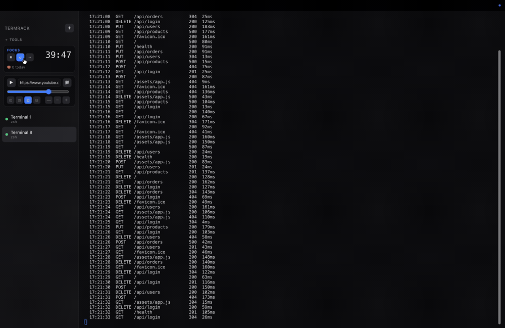

# Termrack



A small, fully-local, cmux-style terminal app for macOS: a sidebar of terminal
sessions on the left, the selected session's terminal filling the pane on the
right. Each session is a **real shell** running in a pseudo-terminal (PTY), so it
behaves exactly like Terminal.app — colors, `vim`, `htop`, Ctrl-C, tab
completion, the lot.

No telemetry, no network calls, no third-party services.

📖 **[Full documentation, shortcuts & roadmap → DOCS.md](DOCS.md)**

## Stack

- **Electron** — the desktop shell / window
- **[xterm.js](https://xtermjs.org)** — terminal rendering in the UI
- **[node-pty](https://github.com/microsoft/node-pty)** — spawns your real `$SHELL` in a PTY

## Run it

```bash
npm install   # also rebuilds node-pty against Electron (postinstall)
npm start
```

If `node-pty` ever errors after an Electron upgrade, rebuild the native module:

```bash
npm run rebuild
```

## Keyboard shortcuts

| Shortcut | Action            |
|----------|-------------------|
| ⌘T       | New terminal      |
| ⌘W       | Close active one  |
| ⌘1–9     | Jump to session N |

Or use the **+** button in the sidebar; click a session to switch; hover and
click **×** to close.

## How it works

- `src/main.js` — Electron main process. Owns every PTY (keyed by id), forwards
  PTY output to the renderer and renderer keystrokes/resizes back to the PTY.
- `src/preload.js` — a narrow `window.term` bridge (contextIsolation on,
  nodeIntegration off). The UI never touches Node directly.
- `src/renderer.js` — the UI: session list, xterm instances, fit-on-resize,
  shortcuts. Programs that set the window title (`\e]0;...\a`) rename the tab.
- `src/index.html` / `src/styles.css` — layout and theme.

## Ideas to extend

- Persist/restore session layout across launches
- Split panes inside the right side
- Per-session working directory picker
- Rename sessions by double-clicking the title
- Search within scrollback (xterm `@xterm/addon-search`)
